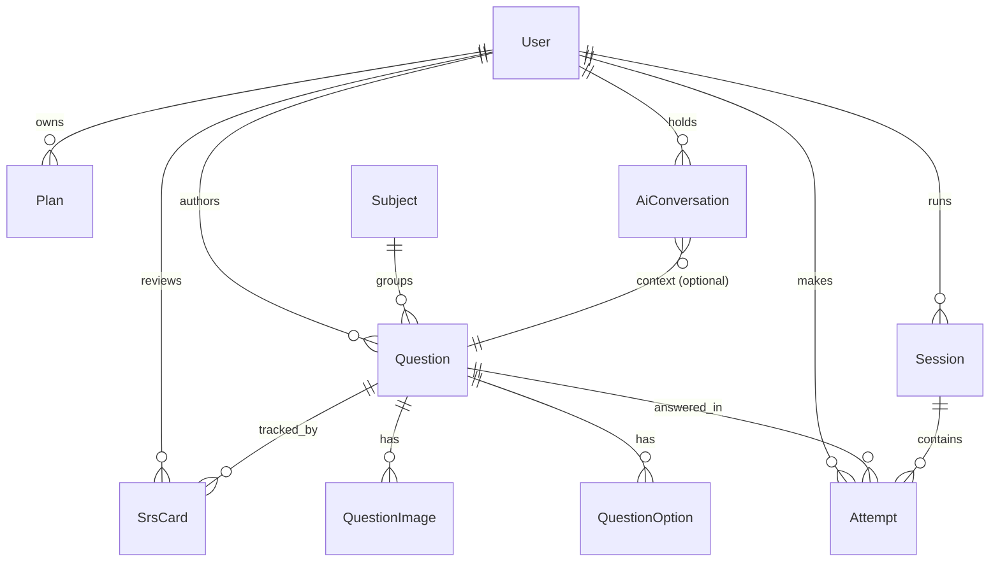

# Data model

The canonical source is [`packages/db/prisma/schema.prisma`](../../packages/db/prisma/schema.prisma). This file is the narrative version — read it to understand *why* the schema looks the way it does.

## ER diagram



## Entities

### `User`

The Postgres-side user record. Created on the first authenticated request (the `@CurrentUser()` decorator does an upsert keyed by `firebaseUid`).

| Field | Type | Notes |
|---|---|---|
| `id` | `cuid` | Internal id, used by every relation. |
| `firebaseUid` | `string` (unique) | Link to Firebase identity. |
| `email` | `string` (unique) | Mirrored from Firebase, kept in sync on each login. |
| `name` | `string?` | Display name. |
| `role` | `Role` enum | `OWNER` for the four humans now. `STUDENT`, `TEACHER` reserved. |
| `track` | `Track?` enum | Future: filter content by drejtimi. Nullable until user picks. |
| `createdAt`, `updatedAt` | timestamps | Standard. |

We deliberately do **not** store passwords or OAuth tokens here. Firebase owns those.

### `Subject`

A small, read-only catalog. Seeded with `matematike` only at MVP.

| Field | Type | Notes |
|---|---|---|
| `slug` | `string` (pk) | `matematike`, later `gjuhe-shqipe`, etc. |
| `nameSq` | `string` | Albanian display name. |
| `order` | `int` | UI ordering. |

### `Question`

The core content entity. Carries Markdown + LaTeX in `promptMd` and `explanationMd`.

| Field | Type | Notes |
|---|---|---|
| `id` | `cuid` | |
| `subjectSlug` | `string` (fk) | References `Subject.slug`. |
| `topicPath` | `string` | Dotted path, e.g. `algjeber.funksione.lineare`. Indexed. |
| `kind` | `QuestionKind` enum | `MCQ` \| `SHORT` \| `LONG`. |
| `difficulty` | `int 1..5` | Authored, calibrated later. |
| `year` | `int?` | If sourced from a past paper. |
| `source` | `string?` | `Matura 2023`, `AkademiaAS seed`, etc. |
| `tracks` | `string[]` | One or more of `pergjithshem`, `natyror`, `shoqeror`, `gjuhesor`. |
| `promptMd` | `text` | Markdown + LaTeX. |
| `correctAnswer` | `text?` | For `SHORT`/`LONG` only. |
| `explanationMd` | `text` | Markdown + LaTeX. Authored, not AI-generated at MVP. |
| `hints` | `string[]` | Authored hint chain. |
| `tags` | `string[]` | Free-form labels. |
| `estimatedSec` | `int` | Authored time estimate. |
| `status` | `QuestionStatus` enum | `DRAFT` \| `REVIEW` \| `PUBLISHED`. |
| `externalId` | `string?` (unique) | Stable id for idempotent seed/import. |
| `createdById` | `cuid` (fk → User) | |
| `createdAt`, `updatedAt` | timestamps | |
| `embedding` | `vector(1536)?` | pgvector. Nullable; populated later. |

**Why `topicPath` as a string?** A real `Topic` table is overkill at MVP. The taxonomy is small, mostly stable, and we want to index by prefix (`startsWith('algjeber.')`). Migrating to a `Topic` table later is straightforward.

### `QuestionOption`

Only used for `MCQ` questions.

| Field | Type | Notes |
|---|---|---|
| `id` | `cuid` | |
| `questionId` | fk → Question | Cascade delete. |
| `label` | `text` | Markdown + LaTeX. |
| `isCorrect` | `bool` | At least one must be `true` per question. |
| `order` | `int` | Display order. Shuffled at runtime. |

### `QuestionImage`

| Field | Type | Notes |
|---|---|---|
| `id` | `cuid` | |
| `questionId` | fk → Question | Cascade delete. |
| `r2Key` | `string` | Object key in R2/MinIO. |
| `alt` | `string` | Albanian alt text, mandatory. |
| `order` | `int` | Display order. |
| `role` | `ImageRole` enum | `INLINE` (in prompt), `FIGURE` (separate figure), `FULL_QUESTION` (entire question is the image). |

The web fetches images via a public R2 URL (or an API-signed URL in prod for private buckets — TBD).

### `Session`

A practice session. Sessions are ephemeral but recorded for analytics later.

| Field | Type | Notes |
|---|---|---|
| `id` | `cuid` | |
| `userId` | fk → User | |
| `kind` | `SessionKind` enum | `PRACTICE` only at MVP. `MOCK`, `PLAN` reserved. |
| `configJson` | `jsonb` | E.g., `{ "subjectSlug": "matematike", "count": 10 }`. |
| `startedAt` | timestamp | |
| `endedAt` | timestamp? | |

### `Attempt`

One row per question answered.

| Field | Type | Notes |
|---|---|---|
| `id` | `cuid` | |
| `userId` | fk → User | Indexed. |
| `questionId` | fk → Question | Indexed. |
| `sessionId` | fk → Session? | Optional; ad-hoc attempts allowed later. |
| `answer` | `text` | The user's submitted answer. For MCQ, the option id. |
| `isCorrect` | `bool` | Computed at write time. |
| `timeMs` | `int` | Time spent on the question. |
| `createdAt` | timestamp | |

Queries we expect:
- "Per-topic correctness for user X" → group by `Question.topicPath`, average `isCorrect`.
- "Last 200 attempts for user X" → ordered by `createdAt DESC`.
- "How many attempts on question Q this week" → for content quality monitoring.

### `Plan` (stub)

Empty at MVP. Schema exists so the foreign keys are stable when we build the plan generator.

| Field | Type | Notes |
|---|---|---|
| `id` | `cuid` | |
| `userId` | fk → User | |
| `examDate` | date | |
| `generatedAt` | timestamp | |
| `specJson` | `jsonb` | Plan structure. |

### `AiConversation` (stub)

Empty at MVP. Holds future AI tutor threads scoped to a question or topic.

| Field | Type | Notes |
|---|---|---|
| `id` | `cuid` | |
| `userId` | fk → User | |
| `contextType` | enum | `QUESTION`, `TOPIC`, `SESSION`, `FREE`. |
| `contextId` | string? | Polymorphic id depending on `contextType`. |
| `messagesJson` | `jsonb` | Array of `{ role, content, ts }`. |
| `createdAt` | timestamp | |

### `SrsCard` (stub)

Empty at MVP. Spaced-repetition card for adaptive practice in v1.

| Field | Type | Notes |
|---|---|---|
| `id` | `cuid` | |
| `userId` | fk → User | |
| `questionId` | fk → Question | Indexed. |
| `nextDueAt` | timestamp | |
| `intervalDays` | `int` | |
| `ease` | `float` | SM-2-like or simpler. |

## Enums

```ts
enum Role        { OWNER, STUDENT, TEACHER }            // only OWNER used at MVP
enum Track       { PERGJITHSHEM, NATYROR, SHOQEROR, GJUHESOR }
enum QuestionKind   { MCQ, SHORT, LONG }
enum QuestionStatus { DRAFT, REVIEW, PUBLISHED }
enum ImageRole      { INLINE, FIGURE, FULL_QUESTION }
enum SessionKind    { PRACTICE, MOCK, PLAN }
enum AiContext      { QUESTION, TOPIC, SESSION, FREE }
```

## Indexes (first migration)

- `User.firebaseUid` unique
- `User.email` unique
- `Question(subjectSlug, status)` composite — list queries always filter by both.
- `Question.topicPath` plain — for prefix matches.
- `Attempt(userId, createdAt DESC)` — recent attempts.
- `Attempt(questionId)` — per-question stats.
- `Session(userId, startedAt DESC)`.
- `Question.embedding` ivfflat (vector ops, `lists=100`) — created but unused at MVP.

## Migrations

The first migration (`init`) creates everything above and enables the `vector` extension. Subsequent migrations are forward-only; `db:reset` drops and re-applies for local dev only.

## Why some tables exist but are empty

`Plan`, `AiConversation`, `SrsCard`: defining them now means future features can ship without touching foreign keys on heavily-written tables (`User`, `Question`). Empty tables are nearly free.
