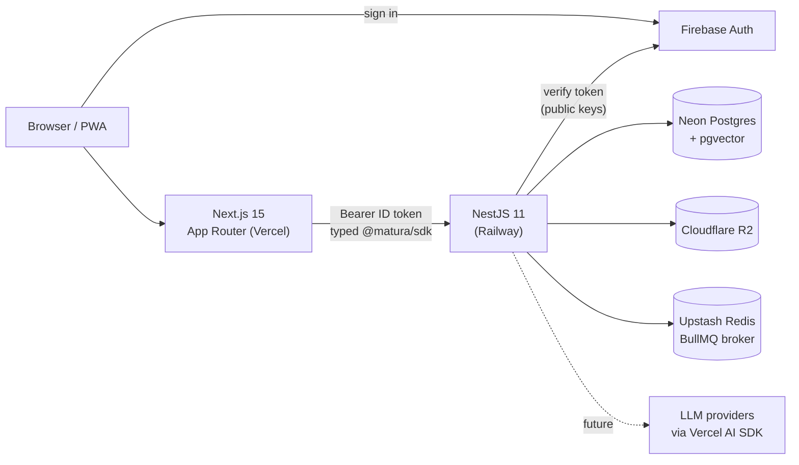
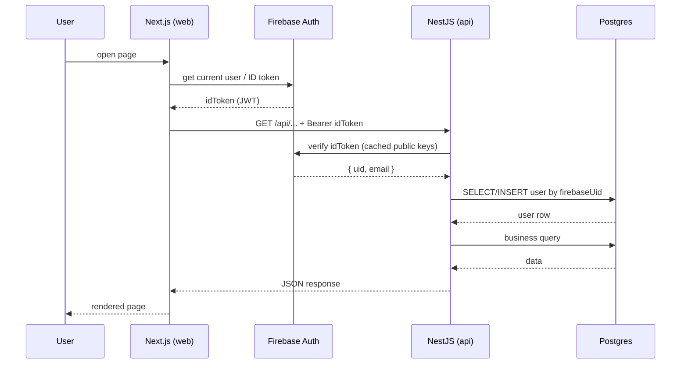
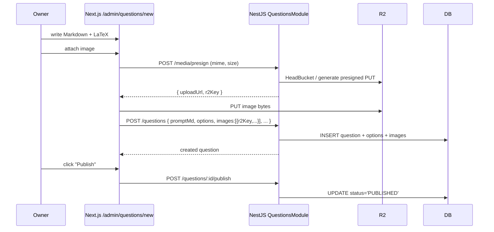

# Architecture overview

## High-level system



## Boundaries

There is **one logical service**: the NestJS API. Next.js is a pure consumer of that service. We deliberately resist the temptation to put business logic in Next.js Server Actions; everything mutating goes through the API so that:

- A future Expo mobile app can share the same backend.
- The four owners can experiment with the API directly via Swagger.
- The API surface is the same in dev and prod.

## Request flow (authenticated)



The `FirebaseAuthGuard` and the `@CurrentUser()` decorator together hide all of this from feature code. A controller method just declares `currentUser: User` and gets a Postgres-backed `User` row.

## Module shape (NestJS)

Each domain lives in its own module under `apps/api/src/modules/`:

- `users` — profile (`/me`), role management.
- `subjects` — read-only catalog.
- `questions` — owner CRUD, publish/unpublish, image presigned URLs.
- `attempts` — recording answers.
- `sessions` — practice/mock session orchestration.
- `media` — R2 upload helpers, presigned URLs.
- `content` — bulk import pipeline (legacy JSON + PNG).
- `ai` — empty shell for now; will host Vercel AI SDK calls.
- `admin` — owner-only metrics endpoints.
- `health` — liveness/readiness.

Each module exposes its public surface through DTOs validated by Zod schemas from `@matura/shared`. The OpenAPI generator picks them up and produces the `@matura/sdk` typed client.

## Module shape (Next.js)

`apps/web/app` uses Route Groups to separate audiences:

- `(marketing)` — public landing, no auth.
- `(app)` — student app, authenticated. Practice, profile.
- `(admin)` — owner-only. Question authoring, metrics.

A single `<AuthProvider />` exposes the Firebase user + role. The `(admin)` layout asserts `role === 'OWNER'` and redirects otherwise.

## Data flow: question authoring



## Data flow: practice session

```mermaid
sequenceDiagram
    participant Student
    participant Web as Next.js /practice/matematike
    participant API as NestJS
    participant DB

    Student->>Web: open page
    Web->>API: GET /practice/sessions?subject=matematike&count=10
    API->>DB: SELECT 10 random PUBLISHED matematike questions
    DB-->>API: rows
    API-->>Web: { sessionId, questions[] }
    Web-->>Student: render question 1
    Student->>Web: submit answer
    Web->>API: POST /attempts { sessionId, questionId, answer, timeMs }
    API->>DB: INSERT attempt; compute isCorrect
    API-->>Web: { isCorrect, explanationMd }
    Web-->>Student: feedback + next question
    Student->>Web: finish session
    Web->>API: POST /sessions/:id/end
    API->>DB: UPDATE session.endedAt
    API-->>Web: summary { correct, total, perTopic }
```

## Why this shape (in one paragraph each)

**Why a separate API service?** Three reasons. (1) NestJS gives us strong module boundaries and decorators that are far easier to teach to the three student contributors than ad-hoc Server Actions. (2) Future mobile apps will share the same API. (3) Owners can poke the API via Swagger to debug content quickly. The cost — duplicate type definitions across boundaries — is paid by the OpenAPI-generated SDK.

**Why Firebase Auth, not in-house?** Speed and mobile readiness. Firebase handles email verification, password reset, OAuth providers, and rate-limiting on auth out of the box. Vendor coupling is real but tolerable: passwords aren't portable out of Firebase, but every other field lives in our Postgres so a migration would be expensive but not catastrophic.

**Why Postgres + Prisma over Supabase?** We want NestJS to own business logic, which makes Supabase's auto-API and RLS dead weight. Neon (Postgres-as-a-service) gives us per-PR DB branches and serverless scaling without those constraints.

**Why pgvector on day one?** Cheap to enable, free to ignore. The moment we need semantic search across questions or AI tutor context, the column is there. No backfill needed.

**Why no tests yet?** Per ADR-0009: speed-of-iteration trumps regression coverage at this scale (four owners, no users). Test runners stay installed; tests are added when the cost of regressions starts to bite.
